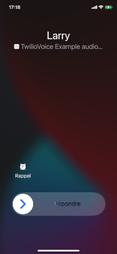
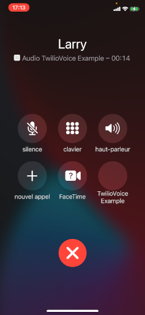

# React Native Twilio Phone


This module allows you to add voice-over-IP (VoIP) calling into your React Native app using [Twilio Programmable Voice](https://www.twilio.com/docs/voice).

It is built on top of 3 modules:

- [React Native CallKeep](https://github.com/react-native-webrtc/react-native-callkeep): Manage VoIP calls with native UI (**CallKit** on iOS and **ConnectionService** on Android)

- [React Native Firebase Messaging](https://github.com/invertase/react-native-firebase/tree/master/packages/messaging): Handle VoIP push notifications on Android

- [React Native VoIP Push Notification](https://github.com/react-native-webrtc/react-native-voip-push-notification): Handle VoIP push notifications on iOS

Supported versions:

- iOS 11+
- Android API 23+

## Example

An example app is provided in the [example folder](https://github.com/MrHertal/react-native-twilio-phone/tree/master/example). Check [below instructions](#Example-app) to run it.

Android call to iOS:





iOS call to Android:


## Before installation

Before setting up this module, you need to install the 3 dependencies listed above in your app. Then you have to configure a server that generates an access token used by Twilio.

### React Native CallKeep

Install [React Native CallKeep](https://github.com/react-native-webrtc/react-native-callkeep) and follow their instructions for [iOS](https://github.com/react-native-webrtc/react-native-callkeep/blob/master/docs/ios-installation.md) and [Android](https://github.com/react-native-webrtc/react-native-callkeep/blob/master/docs/android-installation.md).

### React Native Firebase Messaging

Install [React Native Firebase Messaging](https://github.com/invertase/react-native-firebase/tree/master/packages/messaging).

You can skip the iOS installation steps as we use this module only on Android.

### React Native VoIP Push Notification

Install [React Native VoIP Push Notification](https://github.com/react-native-webrtc/react-native-voip-push-notification).

The following modifications must be made on `AppDelegate.m` in order to handle Twilio notifications:

```objectivec
// --- Handle incoming pushes (for ios >= 11)
- (void)pushRegistry:(PKPushRegistry *)registry didReceiveIncomingPushWithPayload:(PKPushPayload *)payload forType:(PKPushType)type withCompletionHandler:(void (^)(void))completion {
  // --- Retrieve information from Twilio push payload
  NSString *uuid = [[[NSUUID UUID] UUIDString] lowercaseString];
  NSString *callerName = [payload.dictionaryPayload[@"twi_from"] stringByReplacingOccurrencesOfString:@"client:" withString:@""];
  NSString *handle = [payload.dictionaryPayload[@"twi_to"] stringByReplacingOccurrencesOfString:@"client:" withString:@""];

  // --- Process the received push
  [RNVoipPushNotificationManager didReceiveIncomingPushWithPayload:payload forType:(NSString *)type];

  // --- You should make sure to report to callkit BEFORE execute `completion()`
  [RNCallKeep reportNewIncomingCall:uuid
                             handle:handle
                         handleType:@"generic"
                           hasVideo:NO
                localizedCallerName:callerName
                    supportsHolding:YES
                       supportsDTMF:YES
                   supportsGrouping:YES
                 supportsUngrouping:YES
                        fromPushKit:YES
                            payload:payload.dictionaryPayload
              withCompletionHandler:nil];

  completion();
}
```

### Twilio server-side web application

Follow the Twilio Voice [iOS SDK Quickstart](https://www.twilio.com/docs/api/voice-sdk/ios/getting-started) and [Android SDK Quickstart](https://www.twilio.com/docs/api/voice-sdk/android/getting-started), in order to prepare your Twilio environment.

There are two options for configuring a server application. The new option is to deploy to Twilio Serverless the server application included in the two quickstart projects. The old option is to run one of the starter project such as [voice-quickstart-server-node](https://github.com/twilio/voice-quickstart-server-node).

## Installation

Now come the easy part :)

```sh
npm install react-native-twilio-phone
```

### iOS

Run this command to complete installation on iOS:

```sh
cd ios/ && pod install
```

You must also create a Swift file like [this one](https://github.com/MrHertal/react-native-twilio-phone/blob/master/example/ios/File.swift) in the `/ios` folder. If you don't have such a file, your app may not build.

## Usage

### RNTwilioPhone

Use `RNTwilioPhone` class to easily receive incoming calls or start outgoing calls.

```jsx
import * as React from 'react';
import { RNTwilioPhone } from 'react-native-twilio-phone';

// ...

// Options passed to CallKeep (https://github.com/react-native-webrtc/react-native-callkeep#setup)
const callKeepOptions = {
  ios: {
    appName: 'TwilioPhone Example',
    supportsVideo: false,
  },
  android: {
    alertTitle: 'Permissions required',
    alertDescription: 'This application needs to access your phone accounts',
    cancelButton: 'Cancel',
    okButton: 'OK',
    additionalPermissions: [],
    // Required to get audio in background when using Android 11
    foregroundService: {
      channelId: 'com.example.reactnativetwiliophone',
      channelName: 'Foreground service for my app',
      notificationTitle: 'My app is running on background',
    },
  },
};

// Async function that returns Twilio access token
async function fetchAccessToken() {
  const response = await fetch(
    'https://XXXXXX.ngrok.io/accessToken?identity=alice'
  );
  const accessToken = await response.text();

  return accessToken;
}

// RNTwilioPhone options
const options = {
  requestPermissionsOnInit: true, // Default: true - Set to false if you want to request permissions manually
};

export function MyComponent() {
  // Initialize once when component did mount
  // Execute returned function when component will unmount to avoid memory leaks
  React.useEffect(() => {
    // This will set up CallKeep and register device for incoming calls
    return RNTwilioPhone.initialize(callKeepOptions, fetchAccessToken, options);

    // Or use initializeCallKeep if you just want to make outgoing calls
    // return RNTwilioPhone.initializeCallKeep(callKeepOptions, fetchAccessToken, options);
  }, []);

  // Function that starts an outgoing call
  async function startCall() {
    try {
      await RNTwilioPhone.startCall('+00123456789');
    } catch (e) {
      console.log(e);
    }
  }

  // Call this function to unregister device from incoming calls
  // Useful when user signs out for example
  async function unregister() {
    try {
      await RNTwilioPhone.unregister();
    } catch (e) {
      console.log(e);
    }
  }

  // Display active calls
  console.log(RNTwilioPhone.calls);

  // ...
}
```

### Background state

Thanks to [React Native Firebase Messaging](https://github.com/invertase/react-native-firebase/tree/master/packages/messaging) and [React Native VoIP Push Notification](https://github.com/react-native-webrtc/react-native-voip-push-notification), we can receive calls even when app is killed or running in background.

#### iOS

If you added [above code](#React-Native-VoIP-Push-Notification) in your `AppDelegate.m`, your app is ready to handle notifications in background.

#### Android

Call `RNTwilioPhone.handleBackgroundState()` before your app loading. For example in `index.js`:

```javascript
import { AppRegistry } from 'react-native';
import { RNTwilioPhone } from 'react-native-twilio-phone';
import { name as appName } from './app.json';
import { App } from './src/App';

RNTwilioPhone.handleBackgroundState();

AppRegistry.registerComponent(appName, () => App);
```

### Events

Use `twilioPhoneEmitter` to subscribe to module's events:

```jsx
import { twilioPhoneEmitter } from 'react-native-twilio-phone';

// ...

React.useEffect(() => {
  const subscriptions = [
    twilioPhoneEmitter.addListener('CallConnected', (data) => {
      console.log(data);
    }),
    twilioPhoneEmitter.addListener('CallDisconnected', (data) => {
      console.log(data);
    }),
    twilioPhoneEmitter.addListener('CallDisconnectedError', (data) => {
      console.log(data);
    }),
  ];

  return () => {
    subscriptions.map((subscription) => {
      subscription.remove();
    });
  };
}, []);

// ...
```

Following events are available:

```typescript
enum EventType {
  CallInvite = 'CallInvite',
  CancelledCallInvite = 'CancelledCallInvite',
  CallRinging = 'CallRinging',
  CallConnectFailure = 'CallConnectFailure',
  CallConnected = 'CallConnected',
  CallReconnecting = 'CallReconnecting',
  CallReconnected = 'CallReconnected',
  CallDisconnected = 'CallDisconnected',
  CallDisconnectedError = 'CallDisconnectedError',
  RegistrationSuccess = 'RegistrationSuccess',
  RegistrationFailure = 'RegistrationFailure',
  UnregistrationSuccess = 'UnregistrationSuccess',
  UnregistrationFailure = 'UnregistrationFailure',
}
```

### Low level API

Use `TwilioPhone` class to have more control over calls.

```typescript
type TwilioPhoneType = {
  register(accessToken: string, deviceToken: string): void;
  handleMessage(payload: MessagePayload): void;
  acceptCallInvite(callSid: string): void;
  rejectCallInvite(callSid: string): void;
  disconnectCall(callSid: string): void;
  endCall(callSid: string): void;
  toggleMuteCall(callSid: string, mute: boolean): void;
  toggleHoldCall(callSid: string, hold: boolean): void;
  toggleSpeaker(speakerOn: boolean): void;
  sendDigits(callSid: string, digits: string): void;
  startCall(accessToken: string, params: ConnectParams): void;
  unregister(accessToken: string, deviceToken: string): void;
  activateAudio(): void; // iOS only
  deactivateAudio(): void; // iOS only
  checkPermissions(callback: (permissions: Permissions) => void): void;
};
```

### Request permissions manually

If you don't want to request permissions on initialization, set `requestPermissionsOnInit` option to `false`:

```jsx
// ...

export function MyComponent() {
  React.useEffect(() => {
    return RNTwilioPhone.initialize(callKeepOptions, fetchAccessToken, {
      requestPermissionsOnInit: false,
    });
  }, []);
}
```

You can request permissions later by calling `checkPermissions` method on `TwilioPhone`:

```javascript
TwilioPhone.checkPermissions((permissions) => {
  console.log(permissions); // Display the required permissions and their status
});
```

## Example app

To start the example app, first set up [Twilio server-side web application](#Twilio-server-side-web-application).

Then run `yarn bootstrap` in the root directory to install the required dependencies for each package:

```sh
yarn bootstrap
```

To run the example app on Android:

```sh
yarn example android
```

To run the example app on iOS:

```sh
yarn example ios
```

## Contributing

See the [contributing guide](CONTRIBUTING.md) to learn how to contribute to the repository and the development workflow.

## License

MIT
